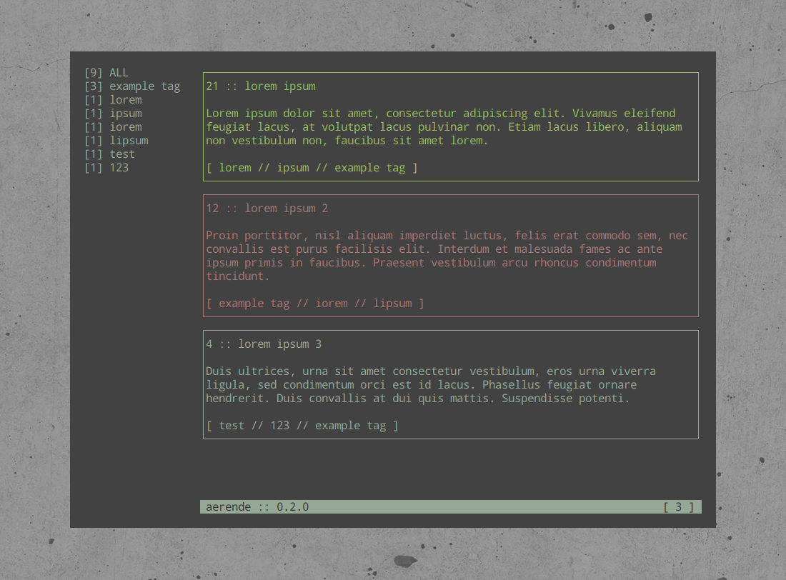

[](http://aerende.readthedocs.io/en/latest/?badge=latest)
[](https://travis-ci.org/Autophagy/aerende)
[](https://pypi.python.org/pypi?:action=display&name=aerende)
[](https://pypi.python.org/pypi?:action=display&name=aerende)

Ærende is a tool to facilitate the recording of reminders, similar to post-it
notes. Written in python, with a curses UI via the [urwid](http://urwid.org/)
library. Documentation is available on
[ReadTheDocs](https://aerende.readthedocs.io/en/latest/).



## Installation

### Via Pip

To install ærende via pip, from :
```
python3.6 -m pip install --user aerende
```

### Via The Repo

To install via the repo, you can set up a clean environment with ``virtualenv``:
```
virtualenv .venv -p python3.6
source .venv/bin/activate
```

Then, install the ``aerende`` package:
```
pip install -e .
```

You can now run ``aerende``.

## Tests

You can run the tests via ``python -m unittest``