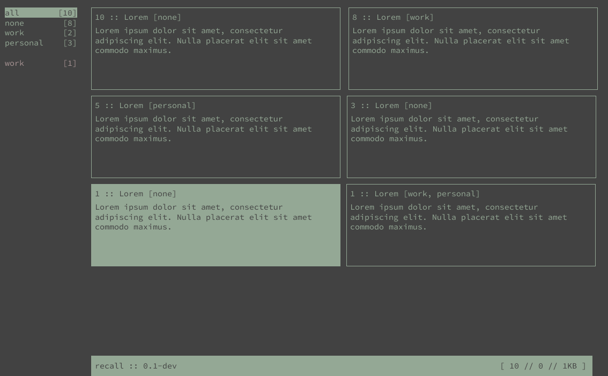

aerende
==================================

About
-----

aerende is a small, python based reminders application. Works offline and in
the terminal via a curses interface. Navigation via vim-esque keys. Designed to
slot easily into my comm workspace alongside weechat and neomutt.

To-Do
-----

- [X] Usage documentation (shortcuts, etc)
- [X] Curses inteface design
- [ ] Curses interface prototype
- [ ] Simple reminder CRUD
- [ ] Reminder categories
- [ ] Reminder deadlines

.. toctree::
   :maxdepth: 2
   :caption: Contents:

.. _usage:

.. toctree::
   :maxdepth: 2
   :caption: Usage

   usage/create-edit-delete-notes
   usage/keybindings
